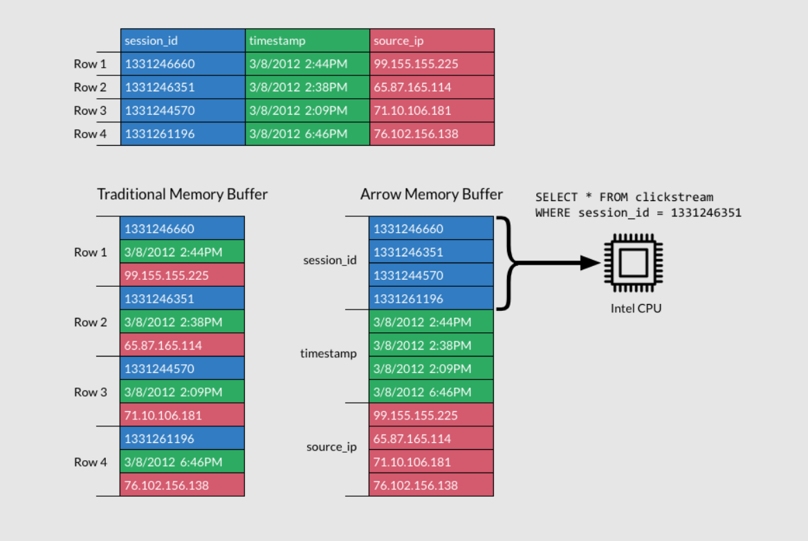

Intro
---
- Hi there! I'm Luciano (_lu-cha-no_)

<!--new_line-->
<!--pause-->
- I'm passionate about data and programming
<!--new_line-->
<!--pause-->
- I love learning new things and sharing knowledge with others
<!--new_line-->
<!--pause-->
- Currently working for a consultancy company in aviation
<!--new_line-->
<!--pause-->
- Actively working in open source and exploring Rust to enhance efficiency
<!-- end_slide -->

Code for this presenetation is available on GitHub
---


<!-- end_slide -->
The state of Data science in Rust
---
<!--pause-->
_"Are we data science yet?"_
==
<!--pause-->

_https://www.arewelearningyet.com/data-structures/_

<!--end_slide-->


The state of Data science in Rust
---
* Currently there are not many crates for data science in Rust
<!--new_line-->
<!--pause-->
* Arrow - The universal columnar format and multi-language toolbox for fast data interchange and in-memory analytics
<!--new_line-->
<!--pause-->
* **Polars** - Dataframes powered by a multithreaded, vectorized query engine, written in Rust
<!--end_slide-->


Some exciting features about Polars
---
Polars is one of the fastest data science tools that is written in Rust with its own compute and buffer implementations, while maintaining compatibility with Apache Arrow. It is more memory efficient than Pandas.
<!-- incremental_lists: true -->
* Native columnar data storage
* Lazy API
* Multi-threaded out of the box
* _Cheap_ Copy-on-Write
* Query plan optimization
    * Predicate pushdown
    * Projection pushdown
    * Aggregate pushdown
<!--end_slide-->


Dataframes and Column oriented storage
---
A Dataframe in polars is a collection of Series (columns) of equal length. Each column has a name and a single data type.
<!--new_line-->
```
┌────────────┬─────┬────────────┬──────┐
│ timestamp  ┆ id  ┆ name       ┆ age  │
│ ---        ┆ --- ┆ ---        ┆ ---  │
│ date       ┆ i64 ┆ str        ┆ i32  │
╞════════════╪═════╪════════════╪══════╡
│ 2023-01-01 ┆ 1   ┆ John Doe   ┆ 25   │
│ 2023-01-02 ┆ 2   ┆ Jane Doe   ┆ 30   │
│ 2023-01-03 ┆ 3   ┆ Bob Smith  ┆ 45   │
└────────────┴─────┴────────────┴──────┘
```
<!--end_slide-->


Column oriented storage
---
<!--new_line-->
Columnar storage is efficient because:

<!-- incremental_lists: true -->
* Better compression - Similar values stored together compress better
* Cache efficiency - Accessing columns keeps data local in memory
* Query optimization - Only reading needed columns reduces I/O
* SIMD operations - Vector operations can process entire columns at once
* Memory efficiency - No need to read unused columns

<!--end_slide-->


Column oriented storage
---

<!--end_slide-->

Lazy vs Eager
---
<!--new_line-->
- **Eager Evaluation**
```
  ───▶ Load Data ───▶ Filter ───▶ GroupBy ───▶ Sort ───▶ Result
```
  Executed immediately step by step

<!--new_line-->
- **Lazy Evaluation**
```
  Load Data ─┐
  Filter    ─┤
  GroupBy   ─┼───▶ Optimize ───▶ Execute ───▶ Result
  Sort      ─┘
```
Plan built first, then optimized & executed
<!--end_slide-->


Show time!: Buildings in Hong Kong
--

<!--end_slide-->


<!--end_slide-->

```json {2-4|5-7|9}
{
"type": "FeatureCollection",
"name": "Buildings_in_Hong_Kong",
"crs": { "type": "name", "properties": { "name": "urn:ogc:def:crs:OGC:1.3:CRS84" } },
"features": [
{ "type": "Feature",
  "properties": {
    "OBJECTID": 1, "BUILDINGSTRUCTUREID": 5243561, "BUILDINGCSUID": "0162608928T20071224", "BUILDINGSTRUCTURETYPE": "T", "CATEGORY": "5", "STATUS": "A", "STATUSDATE": null, "OFFICIALBUILDINGNAMEEN": null, "OFFICIALBUILDINGNAMETC": null, "NUMABOVEGROUNDSTOREYS": null, "NUMBASEMENTSTOREYS": null, "TOPHEIGHT": null, "BASEHEIGHT": null, "GROSSFLOORAREA": null, "RECORDCREATIONDATE": "2007-12-24T00:00:00Z", "RECORDUPDATEDDATE": "2008-01-16T00:00:00Z", "SHAPE__Area": 16.947265625, "SHAPE__Length": 18.893572763678002 },
  "geometry": { "type": "Polygon", "coordinates": ... } },
...]
```

<!--pause-->
This file has 400K features.

<!--end_slide-->


Eager API
--
```rust {1-11|1|8|11}
use polars::prelude::*;
use polars_demo::{load_data, unnest_df};

fn main() -> Result<(), Box<dyn std::error::Error>> {
    let path = std::env::temp_dir().join("hk_buildings.json");
    load_data(&path)?;
    let file = std::fs::File::open(path)?;
    let mut df = JsonReader::new(file).finish()?.select(["features"])?;
    df = unnest_df(&df)?;
    println!("{:?}", df);
    println!("{:?}", df.column("RECORDCREATIONDATE")?);
}


```
<!--end_slide-->


Eager API
--
Let's find out how many building _records_ were created over the years!
<!--end_slide-->


Eager API
--
We can create or modify existing columns!

```rust {1|1-2|1-3|1-11|1-12|1-14|1-16}
df.with_column(
    df.column("RECORDCREATIONDATE")?
        .str()?
        .as_datetime(
            Some("%FT%H:%M:%SZ"),
            TimeUnit::Nanoseconds,
            true,
            false,
            None,
            &ambiguous,
        )?
        .year()
        .with_name("creation_year".into()),
)?;

println!("{:?}", df.column("creation_year")?);
```
<!--end_slide-->


Eager API
--
```rust {3|3-4|3-5|3-9}
println!(
    "{:?}",
    df.group_by(["creation_year"])?
        .select(["OBJECTID"])
        .count()?
        .sort(
            ["OBJECTID_count"],
            SortMultipleOptions::default().with_order_descending(true)
        )
);
```
<!--end_slide-->


Eager API
--

```
┌───────────────┬────────────────┐
│ creation_year ┆ OBJECTID_count │
│ ---           ┆ ---            │
│ i32           ┆ u32            │
╞═══════════════╪════════════════╡
│ 2005          ┆ 204182         │
│ 2008          ┆ 74603          │
│ 2007          ┆ 27891          │
│ 2009          ┆ 10094          │
│ 2006          ┆ 10088          │
│ …             ┆ …              │
│ 2015          ┆ 6010           │
│ 2016          ┆ 4900           │
│ 2020          ┆ 4804           │
│ 2004          ┆ 1567           │
│ 2022          ┆ 1164           │
└───────────────┴────────────────┘
```
<!--end_slide-->


How can we make this faster (Lazy API)
--
The Lazy API in Polars can provide significant performance improvements over eager evaluation by:

<!-- incremental_lists: true -->
* Building a query plan first instead of executing operations immediately
* Allowing the query optimizer to analyze and improve the entire plan
* Pushing predicates down to minimize data read
* Minimizing intermediate allocations
* Parallelizing operations when possible
* Only loading required columns from disk
* Combining multiple operations into optimized steps

<!--end_slide-->


How can we make this faster (Lazy API)
--
```rust
lf = lf.with_column(
    col("RECORDCREATIONDATE")
        .str()
        .strptime(
            DataType::Datetime(TimeUnit::Milliseconds, None),
            StrptimeOptions {
                format: Some("%FT%H:%M:%SZ".into()),
                strict: false,
                exact: true,
                cache: false,
            },
            lit("raise"),
        )
        .dt()
        .year()
        .alias("creation_year"),
)
.group_by(["creation_year"])
.agg([col("OBJECTID").count()])
.sort(
    ["OBJECTID"],
    SortMultipleOptions::default().with_order_descending(true),
)
.collect()?;
```
<!--new_line-->
This builds an optimized plan before executing, rather than processing step-by-step.
<!--end_slide-->


Centroid
--


<!--end_slide-->

We can add native Rust function to our Polars code!
--

```rust
use geo::{Centroid, Polygon};

fn calculate_centroid(coords: Vec<Vec<f64>>) -> Option<(f64, f64)> {
    let polygon = Polygon::new(
        geo::LineString::from(
            coords
                .into_iter()
                .map(|coord| (coord[0], coord[1]))
                .collect::<Vec<_>>(),
        ),
        vec![],
    );

    polygon
        .centroid()
        .map(|centroid| (centroid.x(), centroid.y()))
}
```

<!--end_slide-->


Why Polars in Rust for Production?
---
<!-- incremental_lists: true -->
* **Performance & Resources**
    * Blazing fast query execution
    * Memory efficient with zero-copy operations
    * Native multi-threading support
    * Perfect for resource-constrained environments

* **Production Ready**
    * Strong type system prevents runtime errors
    * Excellent error handling with Result type
    * Cross-platform compatibility

* **Backend Integration**


```rust
// Example with Actix-web
use actix_web::{get, web, App, HttpServer, Result};
use polars::prelude::*;

#[get("/buildings/stats")]
async fn building_stats() -> Result<web::Json<Value>> {
    let lf = LazyFrame::scan_parquet(
        "data.parquet",
        ScanArgsParquet::default()
    )?
    .group_by(["category"])
    .agg([col("height").mean()])
    .collect()?;

    Ok(web::Json(lf.to_json()?))
}
```

<!--end_slide-->


Why Polars in Rust for Production?
---
<!-- incremental_lists: true -->
* **Versatile Data Pipeline Building**
    * Read/Write multiple formats (Parquet, CSV, JSON)
    * Easy integration with Arrow ecosystem
    * Stream processing capabilities
    * Excellent for ETL workflows

* **Developer Experience**
    * Familiar DataFrame API
    * Great documentation and growing community
    * IDE support with type hints
    * Easy to test and benchmark

* **Real-world Use Cases**
    * Data APIs and Microservices
    * Real-time analytics
    * ETL Pipelines
    * Machine Learning Feature Engineering
    * IoT Data Processing


<!--end_slide-->
Summary 🚀
---
<!-- incremental_lists: true -->
* We explored Polars - a powerful DataFrame library for Rust
* Learned about key features:
    * Column-oriented storage
    * Lazy evaluation
    * Native multi-threading
    * Production-ready capabilities
* Demonstrated real-world examples
    * Data loading and transformation
    * Geographic calculations
    * API integration

* The Rust data science ecosystem is growing!

<!--end_slide-->
