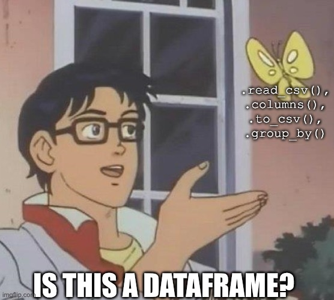

What is Narwhals?
==

Narwhals is a python library that provides a unified interface for working with dataframes in various libraries such as Pandas, Pyspark, DuckDB, etc.


<!-- pause -->



<!-- pause -->
```sh
uv add narwhals
```
Follow along
==


> https://github.com/lucianosrp/talks


Who is Narwhals for?
==

Narwhals is ideal for:
- Library developers who need to support multiple dataframe libraries
- Teams that are dealing with multiple projects that use different dataframe libraries
- Anyone wanting to write dataframe-agnostic code!


Why using Narwhals?
==

# Lightweight
- It has zero dependencies
- Fast
- Little overhead

# Easy to use
- Flexible Polars API syntax
- Compatible with lazy and eager frames


Use case example
==

Let's imagine we have two major projects:

- **Project A**: A data processing pipeline that uses Pandas
- **Project B**: Another project that uses Polars

<!-- pause -->
What if we are tasked to create a new tool that needs to be integrated in both projects?

<!-- pause -->
```python

def get_max_datetime_pd(frame: pd.DataFrame, category: str) -> datetime:
    ...

def get_max_datetime_pl(frame: pl.DataFrame, category: str) -> datetime:
    ...

```
<!-- end_slide -->
```python
def get_max_datetime(frame: pd.DataFrame | pl.DataFrame, category: str) -> datetime:
    if isinstance(frame, pd.DataFrame):
        ...
    elif isinstance(frame, pl.DataFrame):
        ...
    else:
        raise TypeError("Unsupported dataframe type")

```

> [!NOTE]
> In this example, our tool would require both Pandas and Polars to be installed.
<!-- end_slide -->

Use case example (introducing Narwhals)
==

```python
import narwhals as nw

def get_max_datetime(frame: nw.IntoFrame, category: str) -> datetime:
    ...

```
Demo time
==

Don't worry


Narwhalify decorator
==

Narwhals also offers a convenient decorator to simplify the process of creating dataframe-agnostic functions.

```python
def agnostic_group_by_sum(df):
    df = nw.from_native(df, pass_through=True)
    df = df.group_by("a").agg(nw.col("b").sum())
    return nw.to_native(df)
```
Becomes:
<!-- pause -->
```python
@nw.narwhalify
def agnostic_group_by_sum(df):
    return df.group_by("a").agg(nw.col("b").sum())
```

Perfect Backwards compatibility
==

While Narwhals may evolve with potential breaking changes over time, you can rest assured that previous API versions remain fully accessible. All older versions of the API are consistently maintained and exposed for continued use.

<!-- pause -->
### While developing:
```python
import narwhals as nw # Latest Narwhals API (current: V2)
```

<!-- pause -->
### For production use:

```python
import narwhals.stable.V2 as nw # <- Freeze API (Will not change in V3)
```


<!-- pause -->
#### Example
```python
import narwhals.stable.V2 as nw
nw.col("col_a").cum_sum() # <- available in V2 but breaking in V3
```

Contribute!
==
### You found a missing implementation ?
- Please open an issue on our GitHub repository
- Or submit a pull request

### If you want to contribute to Narwhals, we welcome your help!

- Probably one of the most friendly open-source projects out there!
- Good for first-time contributors!
- Join us and help shape the future of dataframe interoperability!

Thanks for listening!
==

<!--jump_to_middle-->
Questions?
